# Search and Rescue Lab - Microsoft AirSim and Custom Vision

## Introduction
The goal of this lab is to work through how to bring real AI to the edge, by creating a custom vision model in the cloud. You will learn the basics of the MS AirSim Drone simulator (https://github.com/microsoft/AirSim) and the Microsoft Custom Vision Cognitive Service (https://www.customvision.ai).


The lab brings a simulated world where we will control the navigation of a drone that must find animals in it. For each animal we will create a dataset of pictures that will be used to train a custom vision classifier model in Azure. this model will be able to identify the animal type from a provided new picture of this animal set.

<p align="center">
   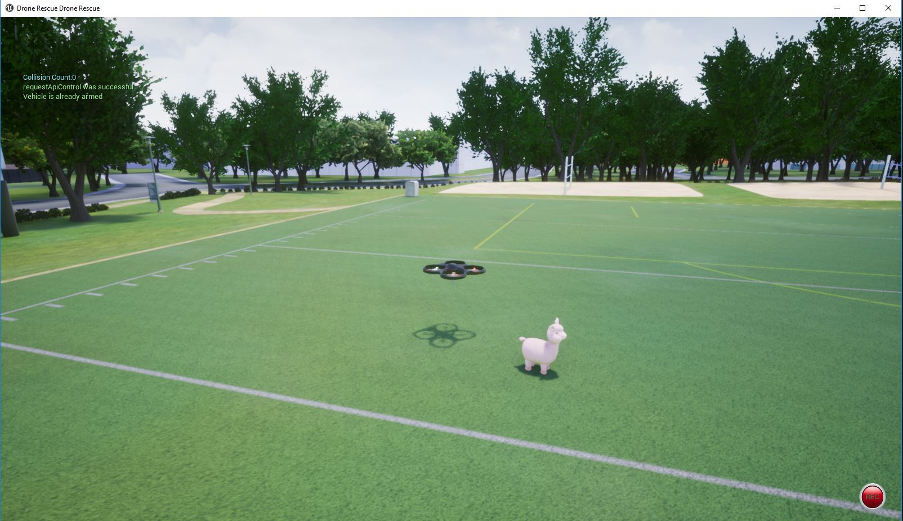
</p>

Your mission, should you choose to accept it, is to work through the guided steps below and be able to export a working model from Custom Vision in TensorFlow format that can be run on an edge device.

The flow of the lab consists of the following steps:
1. Use AirSim to generate training data for your model by flying the virtual drone around the 3D-rendered environment and collecting images of all animals. 

2. Import the images and tag them into a new Custom Vision project, then use the training images to train and test the model.

3. Export the model into TensorFlow format.

---

### Table of Contents
 - Introduction
 - Requirements and Setup
    - Host Machine Requirements
    - Python requirements
    - Install Airsim
    - Install Drone Rescue Lab Code
  - Hands on Lab
    - Run the Airsim simulator
    - Capture Synthetic Images with the Drone
    - Create Custom Vision Model in Azure
    - Finding the Unicorn
    - Exporting a Tensorflow Model
  - Contributing

---
## Requirements and Setup

### Host Machine Requirements
In order to run the AirSim simulator you will need to have a computer with GPU, Windows and DirectX 11 installed. 

**Alternatively**, you can create an Azure Virtual Machine with GPU to run the AirSim server. If you don't have a Microsoft Azure subscription you can create a trial account at https://azure.microsoft.com. Please, follow the steps described in this link: [Creating Azure Virtual Machine for DroneRescue Demo](docs/create_azure_vm.md) 

### Python requirements

You will need to [install Python 3 or higher ](https://www.python.org/downloads/) (if it is not already installed) in your computer. Please, make sure that Python is added to the PATH. And pip is properly installed.

It is also needed to install the `pillow`, `msgpackrpc`, `numpy` and `airsim` python libraries. 

Open a powershell terminal and type:

```
py - m pip install msgpack-rpc-python numpy pillow airsim==1.2.4 --user
```

The libraries are already installed


### Install AirSim

Download and install the AirSim simulator. Use this bundled version prepared for this lab that contains the simulated scenario we are working with: 

1. Click [here](https://dronerescuelab.blob.core.windows.net/dronelab-assets/AirSimRescue.zip) to download the `AirSimServer.zip`.

2. Extract the contents of the zip file to `<your user home>\Documents\AirSimServer`. Open the file explorer and navigate to this folder. You will find in that folder the `run.bat` simulator launcher.

3. Create a `settings.json` file in your **Documents\AirSim** folder and paste in the following AirSim settings:

```
{
  "SeeDocsAt": "https://github.com/Microsoft/AirSim/blob/master/docs/settings.md",
  "SettingsVersion": 1.2,
  "SimMode": "",
  "CameraDefaults": {
    "CaptureSettings": [
      {
        "ImageType": 0,
        "Width": 300,
        "Height": 300,
        "FOV_Degrees": 84,
        "TargetGamma": 2.0,
        "MotionBlurAmount": 1
      }
    ]
  }
}
```

### Download the Drone Rescue Lab Code

Now we will install the drone rescue landscape from GitHub

Clone or download this github repo into a directory called `DroneRescue` in `<your user home>\Documents` folder.

```
git clone https://github.com/microsoft/DroneRescue
```

---
## Hands on Lab

### Run the Airsim simulator
1. Double click `<your user home>\Documents\AirSimServer\run.bat` to start our custom drone rescue landscape. Make sure to click **No** when prompted to use car simulation to start quadrotor simulation. 

   NOTE: if you want to explore the area manually you can select **Yes** to drive a vehicle around, simply restart AirSim to change back to the drone.

2. If prompted to install Microsoft Visual C++ and DirectX, select **Yes** and follow the installation prompts. If you receive a message that Microsoft .NET 3.5 couldn't be installed, you can ignore the message. Try running the drone rescue landscape again (see previous step).

> With the DroneRescue window in focus press **3** to open the drone camera window.

> If you lose your mouse, hit the **Windows** key to get it back.

<p align="center">	
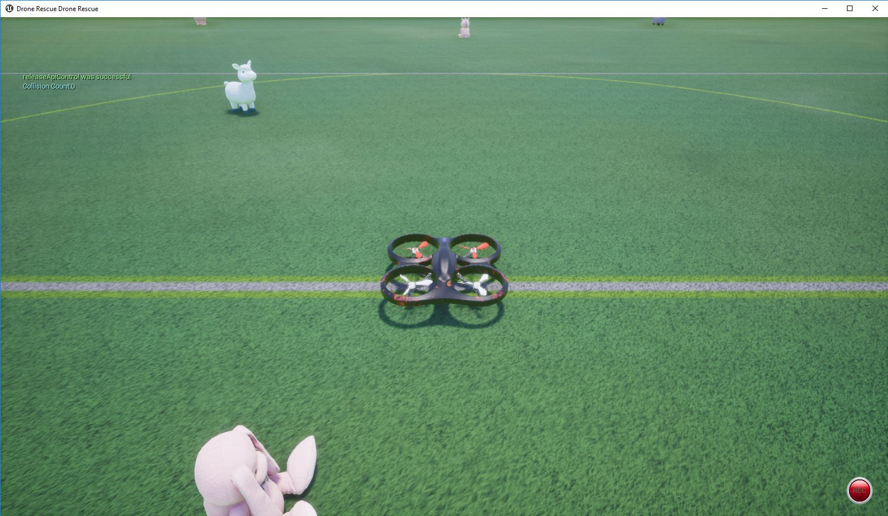	
</p>

### Capture Synthetic Images with the Drone

In this step well will fly the drone around our 3D world and orbit each animal so we can take some photos. Ensure the custom drone rescue landscape world is running in AirSim as per the previous step, we ill connect to the running environment using Python.

The implementation of our navigation controller is located in  the `DroneRescue` repo located in your local folder `<your user home>\Documents\DroneRescue\resources\search_sample.py`. 

Run it in order to start the default navigation task. You can run that file from any python editor such as Visual Studio Code or just open a powershell terminal in the repo folder and type:

```
py resources\search_sample.py
```

After that, the drone will start moving and will navigate to the black sheep animal. It will orbit around it and will take a set of pictures. The pictures will be generated in the `drone_images` folder.

1. Wait until you see **Image capture complete** in the Visual Studio Code output windows and the drone return to the center of the landscape and land.

2. Inspect the images in the generated `drone_images` folder, you should see photo's of the black sheep.
<p align="center">
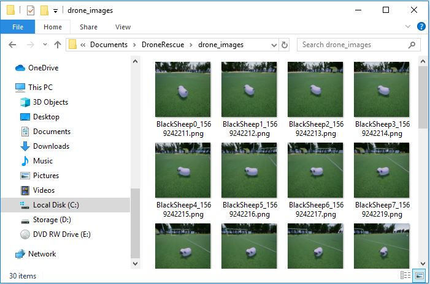
 </p>

> The animal should be in the center of the image as we are going to use them to build and train our Custom Vision model.

> If the drone stops responding, open **Task Manager** and end any **Soccer Field** or **DroneRescue** Unreal tasks.


### Explore the drone navigation code
We encourage you have a look to the navigation code to using [Visual Studio Code](https://code.visualstudio.com/) and learn how you can connect to the AirsimServer and control the drone from the python `airsim` client library.

 - The `resources\search_sample.py` is the main entry point where the main navigation task is implemented. 
- The `resources\drone_orbit.py` file contains the implementation about how the drone can perform an orbital motion around a position.

In the following image we show the entry point code of this drone navigation from Visual Studio Code:

<p align="center">
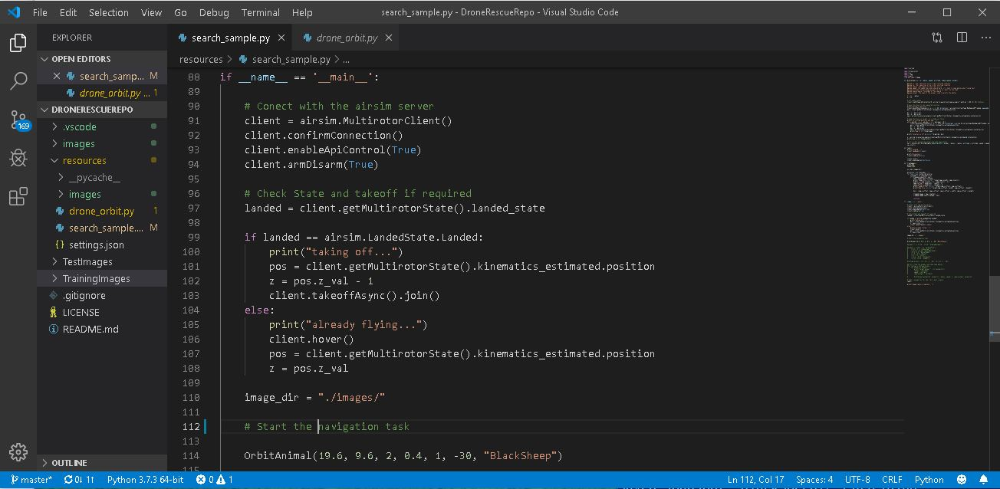
 </p>

You can even start and debug the navigation from Visual Studio Code. In order to do that, please follow the next steps:

1. Using Visual Studio Code, open the`<your user home>\Documents\DroneRescue\` . Click on `resources\search_sample.py` to open the python script.

2. If prompted to install the Python Extension select **Install**, once installed, select **Relod** to activate the extension.

3. Select **View -> Command Palette** and type **Python:Select Interpreter**. You should see the directory you installed Python in earlier, select the directory location.

4. Select **Debug -> Start Without Debugging** then click **Python** to execute the **search_sample.py** script.

5. Switch to the **DroneRescue** landscape you started earlier and observe the drone flying around the environment and orbiting one of the animals.


### Create Custom Vision Model in Azure

Now we will use the images we captured in the previous steps to build and train a Custom Vision Model.

1. Using your web browser, open the following URL in a browser and login using your MSA https://customvision.ai/. 

   Login to the system using your Azure Subscription. If you don't have a Microsoft Azure subscription you can create a trial account at https://azure.microsoft.com. 
   
   
2. After the login, you will see in your `Custom Vision Cognitive Service Dashboard` as it is shown below:

<p align="center">
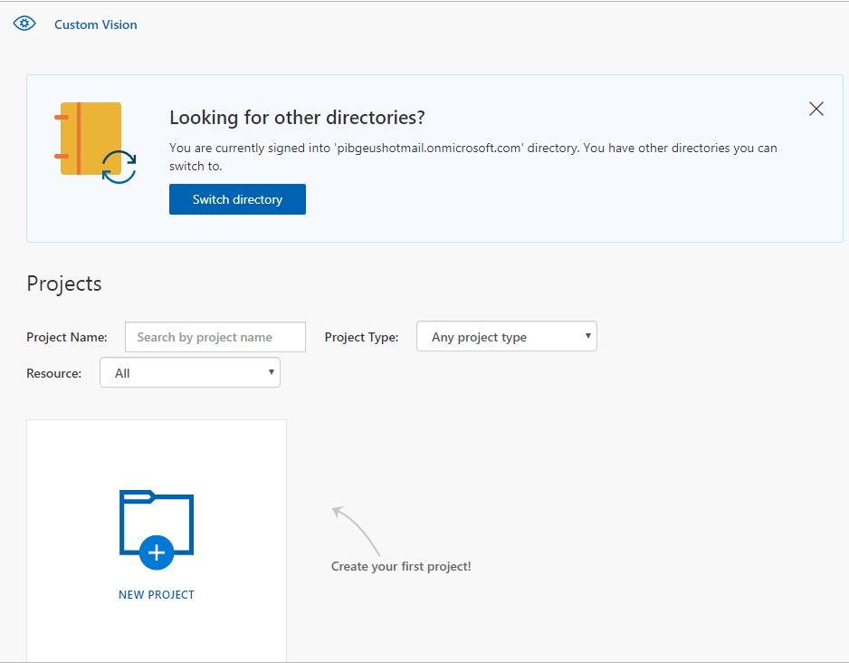
 </p>

 -  Click **New Project** and name it **AirSim Animals**, create a new resource clicking **Resource->create new**

<p align="center">
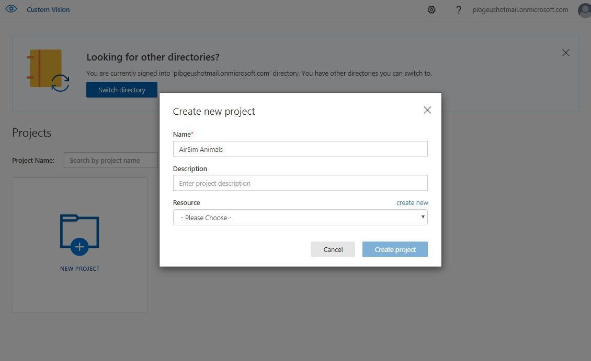
 </p>

 -  We will create now a `Custom Vision Cognitive Service` resource clicking **Resource->create new**
<p align="center">
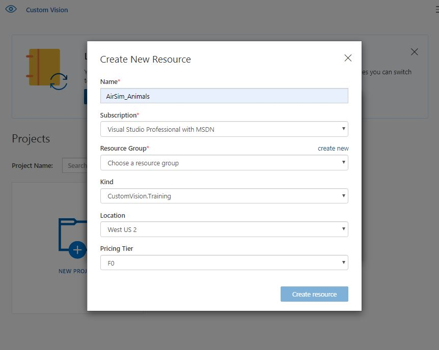
 </p>

 -  Create a new resource group clicking **Resource->create new** to locate your `Custom Vision Cognitive Service` resource already created in your Azure Subscription. Name the resource group **AirSim_Animals**, select the most convenient  location and press the **Create resource group** button.

<p align="center">
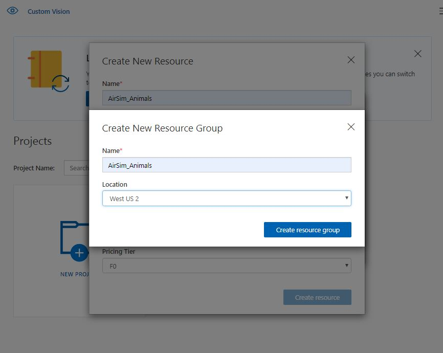
 </p>

 -  Now, Again in the resource creation window, press the **Create Resource** button, to finally get back to the `Create new project window`.

 - In the `Create new project window`, select **Classification** project type, **Multiclass** classification type and **General (compact)** domain. Then click the **Create Project** button. 

<p align="center">
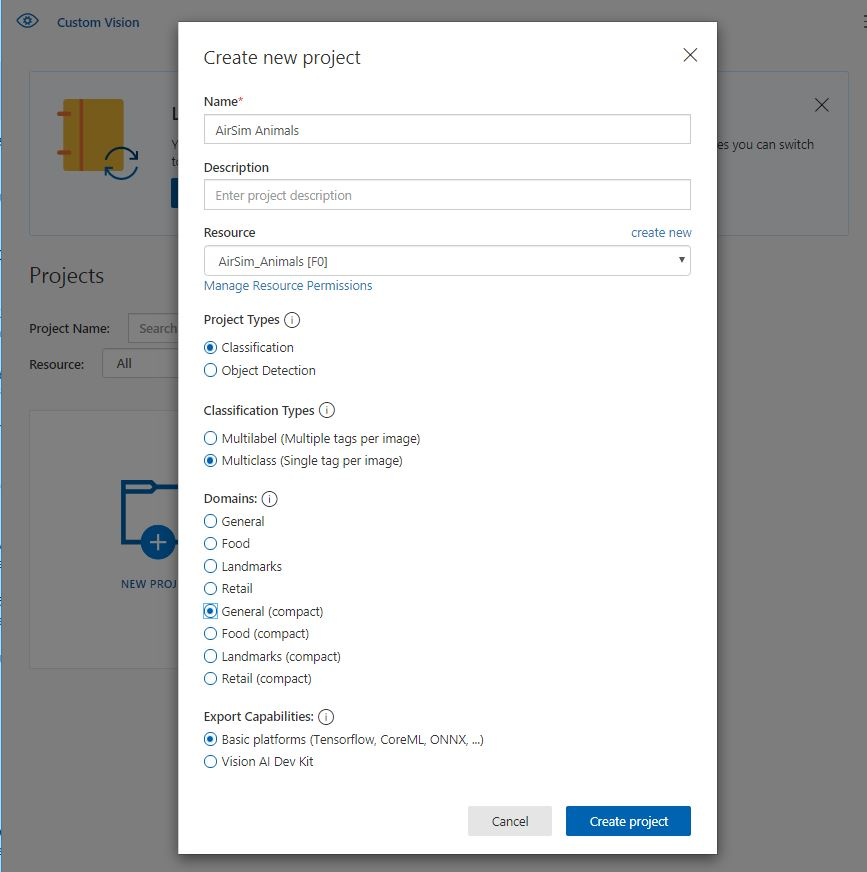
</p>

3. The project is now created. Select the `AirSim Animals` project from the project list in the dashboard.

<p align="center">
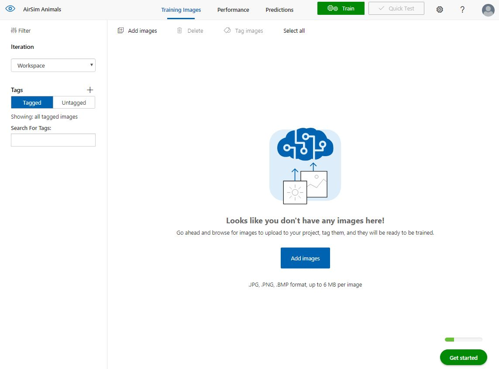
 </p>

4. Now we are going to add the training images we captured from the AirSim search and rescue training environment. Select **Add images** then **Browse local files** and select all the images in the **Images** folder. Enter **Black_Sheep** as your tag, click **+** to add the tag then select **Upload files**. Select **Done** once the images have uploaded successfully.

<p align="center">
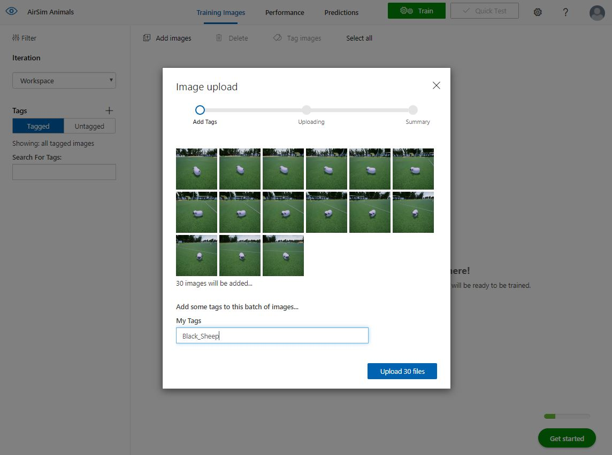
 </p>

5. Upload and tag the images in the **TrainingImages** folder to your Custom Vision model.

6. Next, we will modify **search_sample.py** to locate our next animal and capture images. Return to Visual Studio Code and open **search_sample.py**. 

7. Navigate to the bottom of the file and replace the **Blacksheep** location with the following animal location to the animals array to tell our drone where to locate the next animal:
```
OrbitAnimal(-12.18, -13.56, 2, 0.4, 1, -30, "AlpacaRainbow")
```

8. Save **search_sample.py** and select **Debug -> Start Without Debugging** to execute the file. 

9. Upload and tag the **Alpaca_Rainbow** images from the **Images** folder into Custom Vision.

<p align="center">
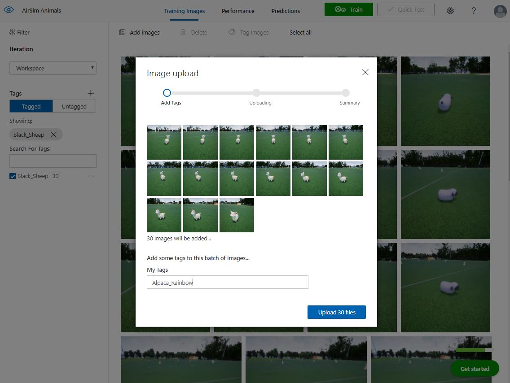
 </p>

10. Now that we have uploaded and tagged two different animals, let's train the model and run a quick test to see how we're doing. Select **"Train"** to start our first training iteration. Once complete you will see the precision and recall for our tagged images, all going well you should see 100% across the board!

<p align="center">
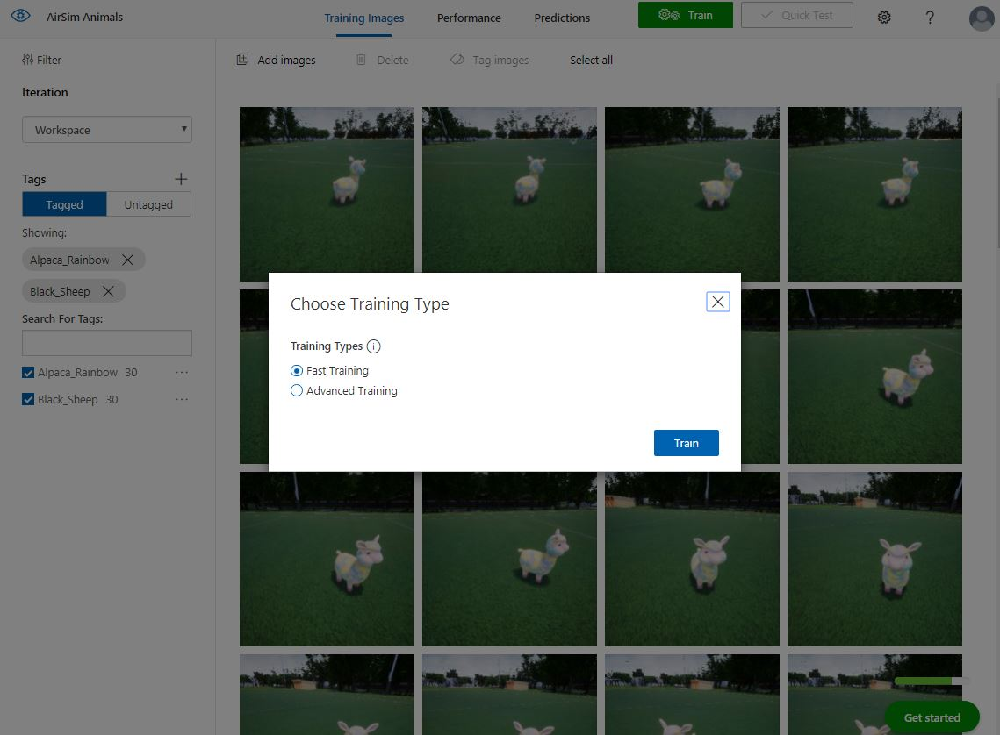

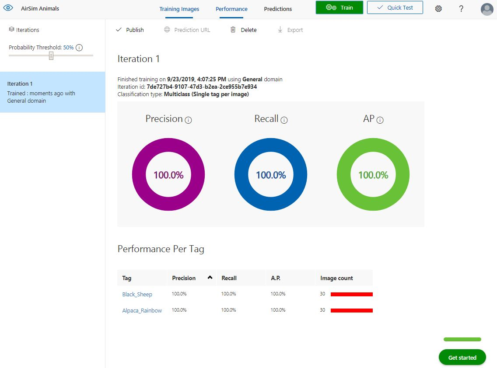
</p>

11.  Let's run a quick test using a real world photograph of our yellow alpaca and see what our newly trained model thinks about it. Select **Quick Test** then **Browse local files**, open the following file **DroneRescue\TestImages\AlpacaRainbow.png**. If you have followed along so far you should see a probability of 99.9% - 100% for the AlpacaRainbow. Now things get a little more interesting!
<p align="center">
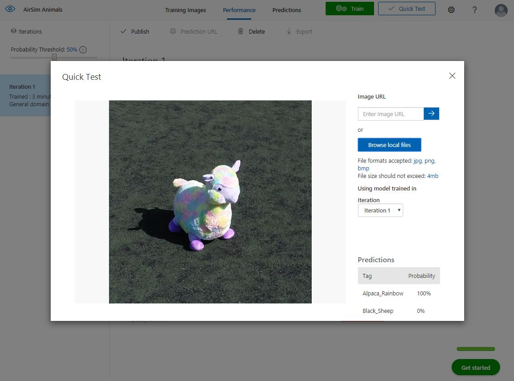
 </p>

12. We don't know what angle or distance the real drone might fly over the lost animals, to help improve our chance of detection, let's add some more images to our dataset. To keep everything in order, move the previous images into another folder, in case we want to use them again later.

13. Our first image capture drone flew a 2 meter radius circle around the animal with the camera angle at 30-degrees. Let's capture some more images at a different radius and camera angle. Edit the following two line of code to move the drone to a 3 meter radius and a camera angle of 20-degrees. 

```
OrbitAnimal(-12.18, -13.56, 3, 0.4, 1, -20, "AlpacaRainbow")
```

14. Save **search_sample.py** and select **Debug -> Start Without Debugging** to execute the file. 

15. Return to **customvision.ai** and add the images as we did previously, tag the new images with **AlpacaRainbow**. Select **Done** once the images have uploaded successfully. 

16. Train the model with the new images and inspect the iteration results.

17. Well that's enough to get you on your way, go forth and search for the remaining animals. Remember the more images you add the better your model will perform. Train and test your model often, think of other interesting ways you could enhance your model, for example, fly low and close to the animals, try different heights, angles, and radius.

Just to keep things moving along, below are the coordinates where you can find the other animals... All of them except the unicorn. Add them to the `search_sample.py` file (you can find some clues about how to do this on the commented python code):

```
animals = [(19.8, -11, "AlpacaPink"),
        (5.42, -3.7, "AlpacaTeal"),
        (-12.18, -13.56, "AlpacaRainbow"),
        (19.6, 9.6, "BlackSheep"),
        (-1.9, -0.9, "Bunny"),
        (3.5, 9.4, "Chick"),
        (-13.2, -0.25, "Chipmunk"),
        (-6.55, 12.25, "Hippo")]
```

To help you out we have provided one real world image of each animal to help refine the model. You can find the images in **TrainingImages** add these to your model with the correct tags.


### Finding the Unicorn

You're probably wondering how you're going to rescue the unicorn? Well, for this you'll need to find the unicorn's coordinates to provide to the script like all the animals above, and then add those images to the Custom Vision model as well. To find the coordinates of the unicorn, you'll need to switch into vehicle mode in AirSim and explore the area to locate the elusive unicorn. 

> You can press the **;** key to open the vehicle detail page that will show you your current position. 

Good luck!


### Exporting a Tensorflow Model

Once you are happy with your model you can export it in Tensorflow format.

1. In Custom Vision, select the **Performance** tab and then select **Export**. Choose **Android (Tensorflow)** as the platform then click **Export** and **Download**.

---

# Contributing

This project welcomes contributions and suggestions.  Most contributions require you to agree to a
Contributor License Agreement (CLA) declaring that you have the right to, and actually do, grant us
the rights to use your contribution. For details, visit https://cla.microsoft.com.

When you submit a pull request, a CLA-bot will automatically determine whether you need to provide
a CLA and decorate the PR appropriately (e.g., label, comment). Simply follow the instructions
provided by the bot. You will only need to do this once across all repos using our CLA.

This project has adopted the [Microsoft Open Source Code of Conduct](https://opensource.microsoft.com/codeofconduct/).
For more information see the [Code of Conduct FAQ](https://opensource.microsoft.com/codeofconduct/faq/) or
contact [opencode@microsoft.com](mailto:opencode@microsoft.com) with any additional questions or comments.
