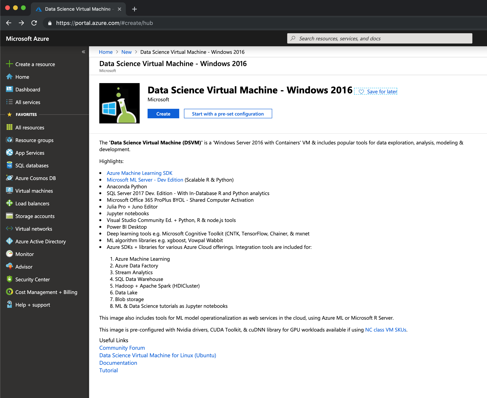
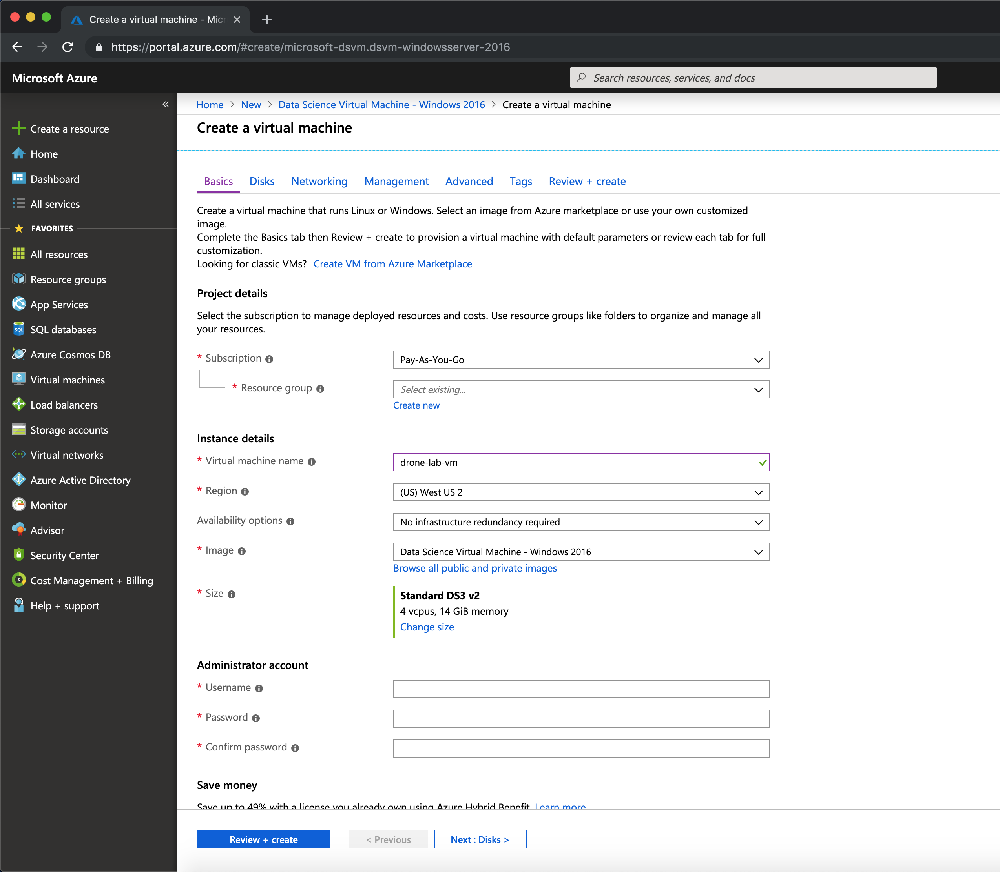
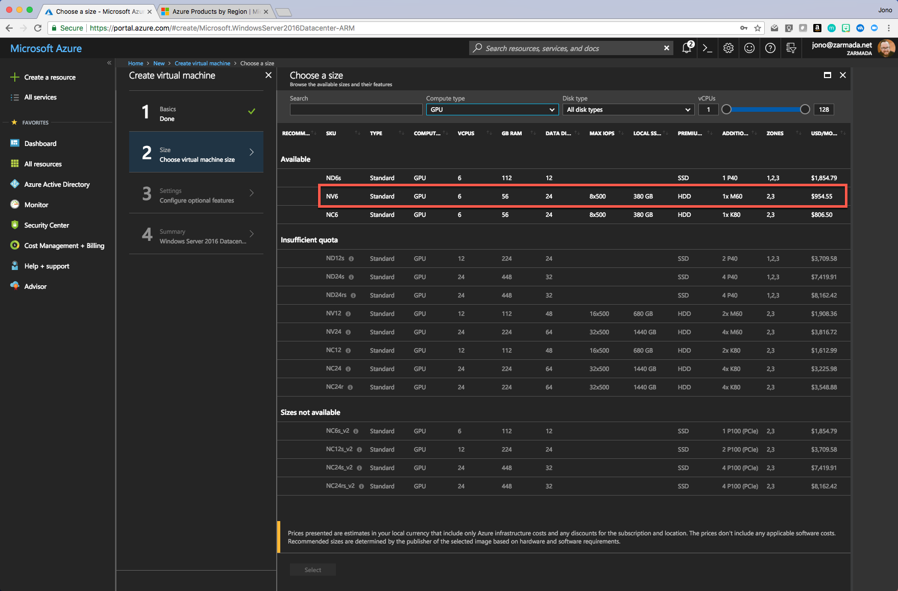
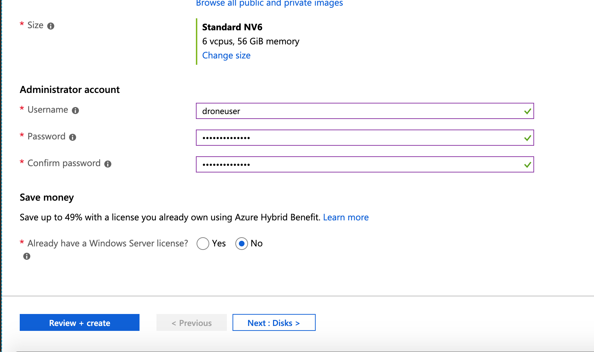
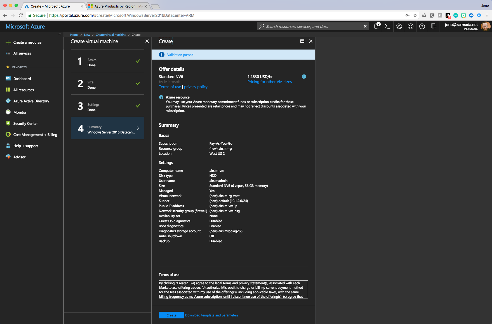

# Create an Azure Virtual Machine with GPU 
This page describe how to create an Azure Virtual Machine with GPU manually for the Drone Rescue Demo.

If you don't have a Microsoft Azure subscription you can create a trial account at https://azure.microsoft.com

1. Login to the Microsoft Azure portal https://portal.azure.com

2. Click **Create a resource** then search for and select **Data Science Virtual Machine - Windows 2016** and click **Create**. 

3. On the **Create virtual machine** slice complete the **Basics** mandatory options ensuring to select one of the supported regions for **NV-series**. You can find NV-series supported regions here https://azure.microsoft.com/global-infrastructure/services. Click **OK** to continue

4. In the **Size** field, click on **Change size**. This opens the **Select a VM size** panel.

5. Click on **Clear all filters**, search for the `NV6` size and **select** it.

    > **Note:** You can actually use any *NV* size. The higher the size, the more powerful the machine will be. For this Lab you won't need a super powerful machine, just a machine with GPUs.

6. In the **Administrator account section**, provide the **Username**, **Password** and **Confirm password** fields.

  > **Note:** Make sure you remember this info as you'll need it to enter your Virtual Machine.

7. Click on **Review + create** to go to the final step.

8. Click on the **Create** button and wait for the creation process, this might take several minutes.

7. Once the new virtual machine provisions click **Connect** then download and open the RDP file using **Microsoft Remote Desktop**

8. Next we will install the Nvidia drivers, download the **NV-series** driver from the following site and follow the instructions https://docs.microsoft.com/en-us/azure/virtual-machines/windows/n-series-driver-setup

> Make sure to select **No** when prompted to use the default security setting if you are using **Internet Explorer** to download materials.
